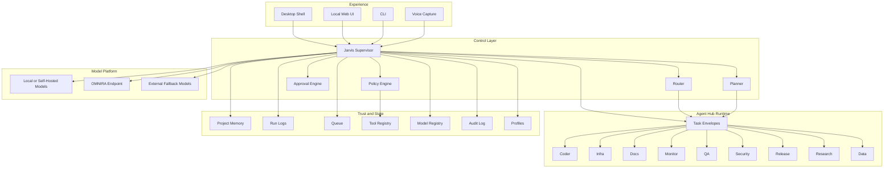

# Architecture (Layers)

Below is a layered view of the current Jarvis operator platform:

Notes:
- Jarvis Supervisor is the owner-facing control plane.
- Specialist work should flow through task envelopes instead of ad hoc prompt chaining.
- Policy and approvals are separate control points, not side effects hidden inside agents.
- Local or self-hosted models are the preferred default, with OMNIRA or external providers used as configured.

