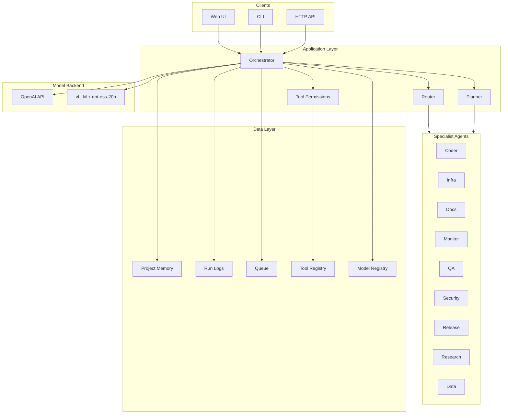

# Architecture (Layers)

Below is a layered view of the agentic application:

Notes:
- Orchestrator is the main control plane.
- Router selects agents automatically when needed.
- Planner produces multi-step task graphs.
- Model backend can be OpenAI or local vLLM.

