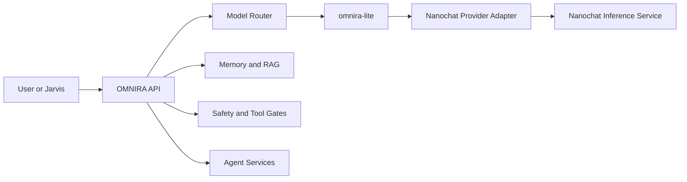

# Nanochat for OMNIRA Lite

## Decision

Use `nanochat` as a separate experimental model lab for `omnira-lite`, not as a direct replacement for the OMNIRA backend.

This keeps OMNIRA's current routing, safety, memory, agent, and provider boundaries intact while giving the team a compact path to train and evaluate a lightweight local assistant model.

## Business View

### Latency Benefit

If a `nanochat`-trained Lite checkpoint is good enough, `omnira-lite` can become faster for everyday assistant traffic because the model can be smaller and tuned for one narrow role instead of many broad roles.

### Cost Benefit

`nanochat` gives the team a realistic path to build and serve a smaller local model for Lite, which can reduce ongoing inference cost compared with relying only on larger general-purpose models.

### Architecture Benefit

OMNIRA keeps its current platform design while gaining an optional custom-model lane for Lite. That means the team can improve one model tier without destabilizing routing, memory, approvals, or agent orchestration.

### Product Benefit

The Lite experience can become more consistent if the model is tuned specifically for OMNIRA's assistant behavior, tone, and everyday prompt mix.

### Risk and Effort

The effort is moderate if the work stays bounded to a provider adapter and a small evaluation loop. The risk becomes high only if `nanochat` is merged into OMNIRA directly or expected to replace OMNIRA platform responsibilities.

### Bottom Line

The main value of `nanochat` is not that it gives OMNIRA a better platform. The main value is that it gives OMNIRA a controlled path to own and optimize the `omnira-lite` model tier.

## Why Lite First

`omnira-lite` is the best first target because its current role is already the smallest and fastest personal-assistant tier.

- It has the lowest capability bar in the current catalog.
- It benefits the most from a custom small local model.
- It has less dependency on complex orchestration than platform, research, or code tiers.
- It gives the clearest latency and cost win if a custom checkpoint performs well enough.

## What Nanochat Is Good For

`nanochat` is useful to OMNIRA in four specific ways:

1. Training a compact chat model for the `omnira-lite` role.
2. Evaluating whether a fine-tuned local model is good enough for daily assistant traffic.
3. Experimenting with identity and tone shaping through supervised fine-tuning.
4. Hosting an isolated inference service that OMNIRA can call through a provider adapter.

## What Nanochat Should Not Replace

`nanochat` should not replace the following OMNIRA layers:

- model catalog and routing
- memory and RAG services
- tool policy and approvals
- multi-agent orchestration
- provider selection and fallback behavior

Those concerns already belong to OMNIRA and should remain there.

## Recommended Architecture

Keep `nanochat` as a sibling repository and use it as an optional backend for `omnira-lite` only.

In this design:

- OMNIRA still decides when `omnira-lite` should be used.
- OMNIRA still owns request metadata, safety flags, and fallback behavior.
- `nanochat` only supplies inference for one model family.

## Integration Surface

The clean insertion point is OMNIRA's provider abstraction in `apps/api/app/models/providers.py`.

Add a `NanochatProvider` that:

- translates OMNIRA `ModelRequest` into `nanochat` chat API input
- calls a dedicated `nanochat` inference endpoint
- returns standard `ModelResponse`
- supports fallback to mock or Ollama if unavailable

No routing changes are needed beyond selecting the provider for the `omnira-lite` model family.

## Suggested Rollout

### Phase 1: Research Sandbox

- Keep `nanochat` separate under the workspace root.
- Do not merge its training stack into `omnira-ai`.
- Use it to test whether a small assistant checkpoint can meet OMNIRA Lite needs.

### Phase 2: Provider Adapter

- Expose a stable inference endpoint from `nanochat`.
- Add `NanochatProvider` in OMNIRA.
- Gate usage behind an environment flag such as `ENABLE_NANOCHAT=true`.
- Limit routing to `omnira-lite`.

### Phase 3: Evaluation Gate

Before any default enablement, compare `nanochat`-backed Lite against current Lite behavior for:

- latency
- answer quality on daily-assistant prompts
- safety behavior
- uptime and recovery behavior
- token and memory footprint

### Phase 4: Controlled Defaulting

Only if Phase 3 is acceptable:

- make `nanochat` the default backend for `omnira-lite`
- keep Ollama as fallback
- keep all other OMNIRA model families on current providers

## Risks

### Architectural Risk

If `nanochat` is pulled into `omnira-ai` directly, OMNIRA will inherit training-centric dependencies and checkpoint assumptions that do not belong in the runtime API.

### Operational Risk

`nanochat` is optimized for experimentation. It is not currently the system of record for OMNIRA-style availability, policy, or persistence.

### Product Risk

A custom Lite model may reduce latency but still underperform on real assistant tasks if the fine-tuning data is not shaped for OMNIRA's use cases.

## Practical Next Step

The next implementation step should be a narrow one:

1. Define the request and response contract for a `nanochat` inference endpoint.
2. Implement a `NanochatProvider` behind a feature flag.
3. Route only `omnira-lite` traffic to it during testing.

That path preserves separation while giving OMNIRA a real experiment with the lowest integration risk.